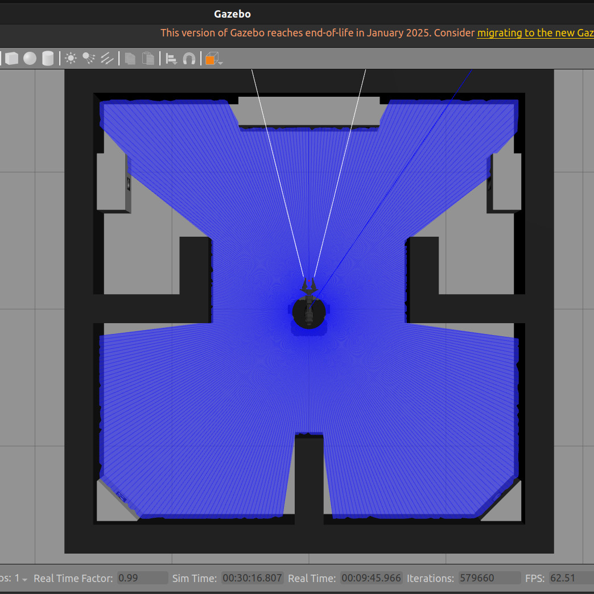
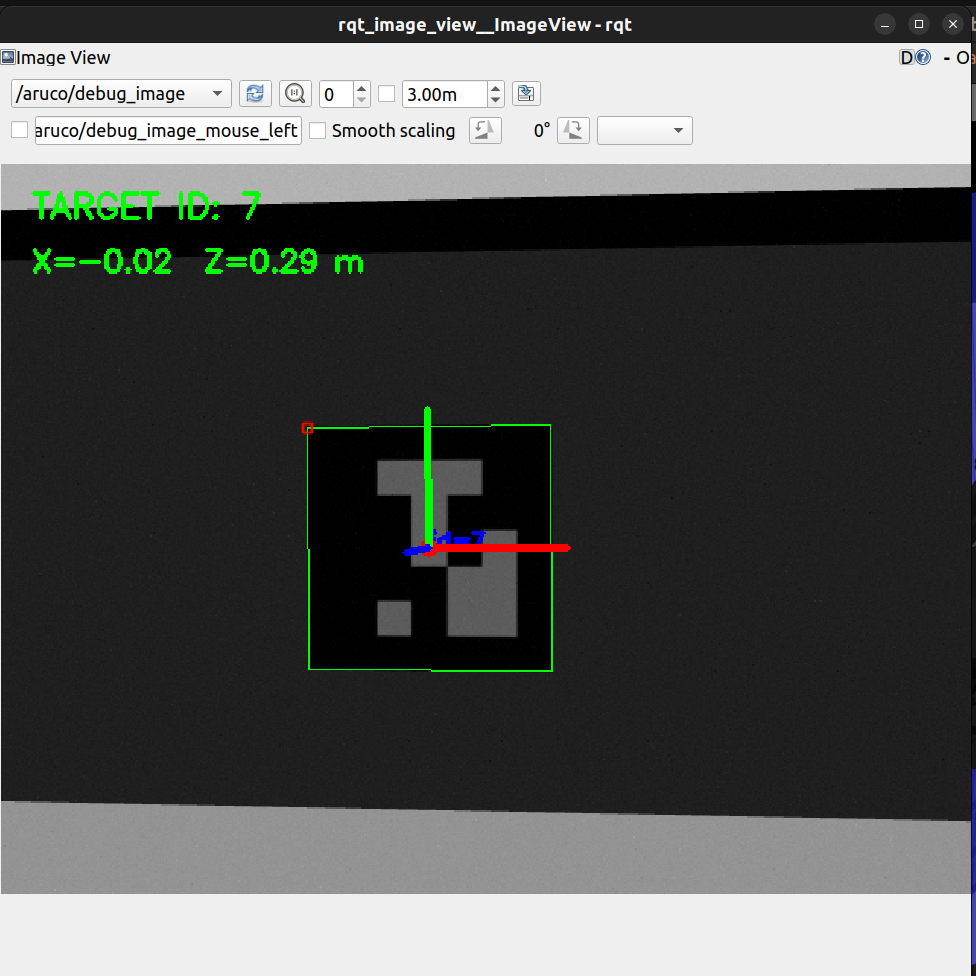
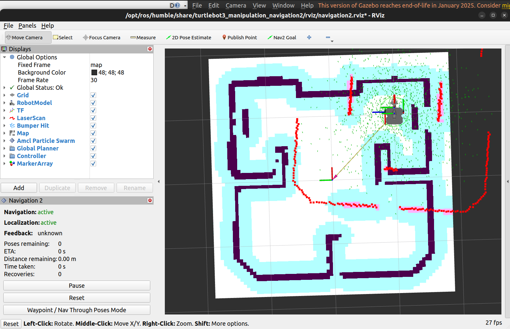
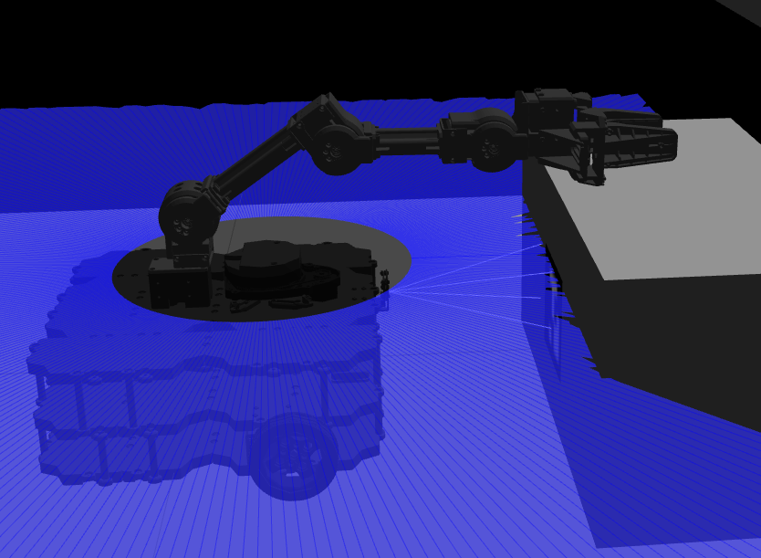

# Autonomous Pick-and-Place Robot

A ROS 2 Humble autonomous pick-and-place robot using TurtleBot3 Waffle Pi, SLAM, Nav2, custom ArUco vision, and OpenMANIPULATOR-X in Gazebo Classic.

## Overview

This project is a custom autonomous mobile-manipulation implementation built on the **TurtleBot3 Home Service Challenge environment**.

The robot uses the Home Service Challenge Gazebo world and adds a custom perception and mission-control pipeline for autonomous pick-and-place.

The current system can:

- Navigate autonomously using SLAM and Nav2
- Detect ArUco markers using a custom OpenCV detector
- Select the required target marker, ID 7
- Center the robot with respect to the target
- Perform a straight-line final visual approach
- Stop at a calibrated pickup distance
- Open and close the gripper automatically
- Move the OpenMANIPULATOR-X to the pickup pose
- Lift the object
- Return to the home position using Nav2

---

## Key Features

- ROS 2 Humble
- Gazebo Classic
- TurtleBot3 Waffle Pi
- OpenMANIPULATOR-X
- SLAM Toolbox
- Nav2
- LiDAR obstacle protection
- Custom ArUco detection
- Target-specific ArUco ID 7
- Camera-based target centering
- Straight-line visual approach
- Automatic arm control
- Automatic gripper control
- Autonomous pick, lift, and return

---

## Project Architecture

The system connects simulation, perception, mapping, navigation, mission control, and manipulation.

```text
                         Gazebo Classic
                              |
                +-------------+-------------+
                |                           |
              Camera                      LiDAR
                |                           |
                v                           v
       Custom ArUco Detector          SLAM Toolbox
                |                           |
                |                           v
                |                          Nav2
                |                           |
                +-------------+-------------+
                              |
                              v
                       Mission Manager
                              |
                    +---------+---------+
                    |                   |
                    v                   v
               Mobile Base        OpenMANIPULATOR-X
                                        |
                                      Gripper
```

---

## Main Technologies

- Ubuntu 22.04
- ROS 2 Humble
- Gazebo Classic
- TurtleBot3 Waffle Pi
- OpenMANIPULATOR-X
- SLAM Toolbox
- Nav2
- LiDAR
- OpenCV ArUco
- Python
- ROS 2 Actions

---

# How to Run the Project

The project is operated using multiple terminals because each major ROS 2 component runs as a separate node or stack.

The exact Gazebo and Nav2 launch files depend on the TurtleBot3 Home Service Challenge setup installed in the workspace. The commands below describe the working pipeline and the commands used for the custom nodes.

---

## Terminal 1 - Start the Home Service Challenge Gazebo World

Source ROS 2:

```bash
source /opt/ros/humble/setup.bash
```

Source the workspace:

```bash
source ~/turtlebot3_ws/install/setup.bash
```

Start the **TurtleBot3 Home Service Challenge Gazebo world using the working launch command for your installation**.

```bash
git clone -b humble https://github.com/ROBOTIS-GIT/turtlebot3_home_service_challenge.git
```
```bash
cd ~/turtlebot3_ws && colcon build --symlink-install
```
```bash
ros2 launch turtlebot3_manipulation_gazebo turtlebot3_home_service_challenge.launch.py
```

### What Terminal 1 does

Gazebo provides the simulated environment containing:

- TurtleBot3 Waffle Pi
- OpenMANIPULATOR-X
- Pi Camera
- LiDAR
- Walls and obstacles
- ArUco markers
- Pick object
- Simulated physics

Gazebo also publishes the sensor information used by SLAM, Nav2, and the custom vision system.

---

## Terminal 2 - Start SLAM

```bash
source /opt/ros/humble/setup.bash
source ~/turtlebot3_ws/install/setup.bash
```
```bash
ros2 launch slam_toolbox online_async_launch.py use_sim_time:=True
```

### What Terminal 2 does

SLAM Toolbox receives LiDAR data from:

```text
/scan
```

It builds the map and provides localization information.

The resulting map is used by Nav2 for autonomous navigation.

---

## Terminal 3 - Start Nav2

Source the environments:

```bash
source /opt/ros/humble/setup.bash
source ~/turtlebot3_ws/install/setup.bash
```

Start the **working Nav2 launch command used in the Home Service Challenge simulation**.
```bash
ros2 launch nav2_bringup navigation_launch.py use_sim_time:=True
```

### What Terminal 3 does

Nav2 is responsible for long-distance navigation.

It:

- Uses the SLAM map
- Plans a path
- Uses costmaps for obstacle avoidance
- Uses LiDAR observations
- Moves the robot to the pickup area
- Returns the robot to the home position

Nav2 is used for global navigation. The camera-based controller handles the precise final approach to ArUco ID 7.

---

## Terminal 4 - Start the Custom ArUco Detector

```bash
source /opt/ros/humble/setup.bash
source ~/turtlebot3_ws/install/setup.bash
```

```bash
ros2 run custom_aruco_detector aruco_detector --ros-args -p target_id:=7
```

### What Terminal 4 does

The custom detector subscribes to:

```text
/pi_camera/image_raw
```

Camera calibration is read from:

```text
/pi_camera/camera_info
```

The detector uses the OpenCV ArUco dictionary:

```text
DICT_5X5_50
```

The environment can contain several markers, but the mission specifically selects:

```text
Target ID = 7
```

The detector also publishes debug information used during the final approach.

---

## Terminal 5 - View the ArUco Debug Image

Start the image viewer:

```bash
source /opt/ros/humble/setup.bash
source ~/turtlebot3_ws/install/setup.bash
```

```bash
ros2 run rqt_image_view rqt_image_view
```

Select:

```text
/aruco/debug_image
```

The debug image shows the detected target and its estimated position.

Important values are:

```text
X = horizontal target position
Z = forward distance to the target
```

The debug image is useful for confirming that ID 7 is correctly detected before the robot performs the final approach.

---

## Terminal 6 - Start the Autonomous Mission

```bash
source /opt/ros/humble/setup.bash
source ~/turtlebot3_ws/install/setup.bash
```

```bash
ros2 run pick_place_mission mission_manager
```

### What Terminal 6 does

The mission manager coordinates the complete autonomous sequence:

```text
Nav2
  |
Pickup area
  |
ArUco ID 7
  |
Target centering
  |
Final visual approach
  |
Gripper OPEN
  |
Arm PICK
  |
Gripper CLOSE
  |
Arm LIFT
  |
Nav2 HOME
  |
Mission COMPLETE
```

---

# How the Robot Works

## 1. Navigate to the Pickup Area

The robot first uses SLAM and Nav2.

Nav2 performs the large-scale movement from the home area toward the pickup area.

The robot uses:

```text
SLAM map
+
Localization
+
Nav2 planner
+
LiDAR costmaps
```

to navigate through the environment.

---

## 2. Detect ArUco Marker ID 7

After reaching the pickup area, the Pi Camera observes the markers.

The custom detector processes:

```text
/pi_camera/image_raw
```

and detects the ArUco markers.

Although multiple markers can be visible, the mission manager selects:

```text
ID 7
```

as the pickup target.

This prevents other markers from becoming the manipulation target.

---

## 3. Estimate the Target Position

The detector estimates the target position relative to the camera.

The two important values are:

```text
X = horizontal position
Z = forward distance
```

The controller uses X for horizontal alignment and Z for the final approach distance.

---

## 4. Center the Target

The robot first aligns itself with ID 7.

The horizontal error is reduced toward:

```text
X -> 0
```

The robot rotates only as necessary to center the marker.

When the target is centered, the robot stops rotating and proceeds with the forward approach.

This avoids the unwanted behavior of continuing to rotate after the target has already been found.

---

## 5. Straight-Line Final Approach

After centering the marker, the robot moves forward.

The intended final-approach motion is:

```text
linear velocity > 0
angular velocity = 0
```

The camera continuously measures the marker distance.

The current calibrated stopping distance is:

```text
Z = 0.15 m
```

When this distance is reached, the mobile base stops.

---

## 6. LiDAR Safety

LiDAR provides an additional obstacle-protection layer.

The navigation costmaps use:

```text
/scan
```

to detect obstacles.

The final approach also uses the forward LiDAR region as a safety condition.

The concept is:

```text
Camera
  |
  +--> Accurate target positioning

LiDAR
  |
  +--> Collision protection
```

---

## 7. Open the Gripper

After the mobile base reaches the pickup position, the robot remains stationary.

The gripper opens through:

```text
/gripper_controller/gripper_cmd
```

The open command creates space for the object before the arm moves into the pickup configuration.

---

## 8. Move the OpenMANIPULATOR-X

The arm is controlled through:

```text
/arm_controller/follow_joint_trajectory
```

The calibrated pickup joint configuration is:

```text
joint1 = 0.0
joint2 = 0.95
joint3 = -0.95
joint4 = 0.0
```

The arm moves to this pose using a joint trajectory.

---

## 9. Close the Gripper

After the arm reaches the pickup position:

```text
Gripper OPEN
      |
      v
Arm reaches pickup pose
      |
      v
Gripper CLOSE
```

The object is then held by the simulated gripper.

---

## 10. Lift the Object

After the gripper closes, the arm moves to the calibrated lift configuration.

The mobile base remains stopped while the object is being lifted.

The purpose is to provide clearance between the object and the pickup structure.

---

## 11. Return to Home

After the object is lifted, the mission manager starts the return navigation.

Nav2 is used again to move from the pickup area to the home position.

The home pose currently used by the mission is approximately:

```text
x   = -0.007 m
y   =  0.001 m
yaw =  0.039 rad
```

The return is autonomous and does not require teleoperation.

---

## 12. Mission Completion

The complete autonomous workflow is:

```text
Gazebo Home Service Challenge World
              |
              v
            SLAM
              |
              v
            Nav2
              |
              v
       Pickup Area
              |
              v
        ArUco ID 7
              |
              v
       Center Target
              |
              v
      Visual Approach
              |
              v
        Z = 0.15 m
              |
              v
       Gripper OPEN
              |
              v
          Arm PICK
              |
              v
      Gripper CLOSE
              |
              v
          Arm LIFT
              |
              v
        Nav2 HOME
              |
              v
      MISSION COMPLETE
```

---

# Custom ROS 2 Packages

## custom_aruco_detector

Location:

```text
src/custom_aruco_detector/
```

Main source file:

```text
src/custom_aruco_detector/custom_aruco_detector/aruco_detector.py
```

Responsibilities:

- Subscribe to camera images
- Detect ArUco markers
- Identify marker IDs
- Estimate marker position
- Publish marker information
- Publish the debug image
- Support target tracking for ID 7

---

## pick_place_mission

Location:

```text
src/pick_place_mission/
```

Main source file:

```text
src/pick_place_mission/pick_place_mission/mission_manager.py
```

Responsibilities:

- Coordinate Nav2
- Select marker ID 7
- Perform visual target centering
- Perform the final visual approach
- Monitor LiDAR safety
- Control the OpenMANIPULATOR-X
- Control the gripper
- Lift the object
- Return the robot home

---

# Important ROS 2 Topics

## Camera

```text
/pi_camera/image_raw
/pi_camera/camera_info
```

## LiDAR

```text
/scan
```

## Mobile Base

```text
/cmd_vel
```

## ArUco

```text
/aruco/marker_ids
/aruco/debug_image
```

## Navigation

```text
/navigate_to_pose
```

## Arm

```text
/arm_controller/follow_joint_trajectory
```

## Gripper

```text
/gripper_controller/gripper_cmd
```

---

# Configuration

The main mission configuration is stored in:

```text
config/pick_config.yaml
```

Current target:

```yaml
marker_id: 7
```

Current pickup navigation pose:

```yaml
pick_pose:
  x: 0.800
  y: -1.067
  yaw: -1.581
```

Current home pose:

```yaml
home_pose:
  x: -0.007
  y: 0.001
  yaw: 0.039
```

Current arm pickup pose:

```yaml
arm_pose:
  joint1: 0.0
  joint2: 0.95
  joint3: -0.95
  joint4: 0.0
```

Final visual stopping distance:

```text
Z = 0.15 m
```

---

# Important Manual Testing Commands

These commands were used during development to verify individual components.

## Check Camera

```bash
ros2 topic info /pi_camera/image_raw -v
```

```bash
ros2 topic echo /pi_camera/camera_info --once
```

## Check LiDAR

```bash
ros2 topic info /scan -v
```

```bash
ros2 topic hz /scan
```

## Check Controllers

```bash
ros2 control list_controllers
```

Expected active controllers include:

```text
joint_state_broadcaster
gripper_controller
imu_broadcaster
arm_controller
```

## Check Arm Action

```bash
ros2 action list | grep arm
```

Expected:

```text
/arm_controller/follow_joint_trajectory
```

## Test Arm Pickup Pose

```bash
ros2 action send_goal /arm_controller/follow_joint_trajectory \
control_msgs/action/FollowJointTrajectory \
"{trajectory: {joint_names: ['joint1','joint2','joint3','joint4'], points: [{positions: [0.0,0.95,-0.95,0.0], time_from_start: {sec: 4}}]}}"
```

## Check End-Effector Position

```bash
ros2 run tf2_ros tf2_echo base_link end_effector_link
```

## Check Robot Pose

```bash
ros2 run tf2_ros tf2_echo map base_link
```

---

# Screenshots

## Gazebo Simulation



## ArUco Detection



## SLAM and Nav2



## Autonomous Pick and Return



---

# Results

The implemented system successfully demonstrates:

- Autonomous navigation to the pickup area
- SLAM-based mapping and localization
- Nav2 path planning
- LiDAR-based obstacle protection
- Custom ArUco detection
- Target-specific marker selection using ID 7
- Camera-based target centering
- Straight-line final approach
- Close-range pickup positioning
- OpenMANIPULATOR-X arm positioning
- Automatic gripper open/close operation
- Object pickup and lifting
- Autonomous return to the home position

---

# Difference from the Official Home Service Challenge

This project uses the **TurtleBot3 Home Service Challenge Gazebo world and core robotics environment**, but adds a custom autonomous perception and mission-control pipeline.

The major custom parts are:

- Custom ArUco detector
- Target-specific selection of marker ID 7
- Camera-based target X/Z estimation
- Visual target-centering logic
- Straight-line final visual approach
- Custom ROS 2 mission manager
- Direct OpenMANIPULATOR-X trajectory control
- Direct gripper control
- Automated Nav2 return-home orchestration

The project therefore follows the same general home-service mobile-manipulation objective while implementing the perception and mission-control workflow specifically for this project.

---

# Current Limitations

- The system is validated in Gazebo Classic simulation.
- The current mission uses a predefined target marker ID (ID 7).
- The system is tuned for the current TurtleBot3 Home Service Challenge environment.
- Pickup and placement depend on simulated collision and contact behavior.
- The current mission focuses on a single target object.

---

# Future Improvements

- Automatic object placement
- Multiple target markers
- Multi-object pick-and-place missions
- Improved grasp and release reliability
- Navigation recovery behaviors
- More robust manipulation planning
- MoveIt-based manipulation planning
- Deployment on a physical TurtleBot3

---

# Project Structure

```text
autonomous-turtlebot3-pick-and-place/
|
├── README.md
├── LICENSE
├── .gitignore
|
├── config/
│   └── pick_config.yaml
|
├── screenshots/
│   ├── architecture.png
│   ├── aruco_detection.png
│   ├── autonomous_pick_place.png
│   ├── gazebo_world.png
│   └── nav2_slam.png
|
└── src/
    |
    ├── custom_aruco_detector/
    │   ├── custom_aruco_detector/
    │   │   ├── __init__.py
    │   │   └── aruco_detector.py
    │   ├── package.xml
    │   ├── resource/
    │   ├── setup.cfg
    │   └── setup.py
    |
    └── pick_place_mission/
        ├── pick_place_mission/
        │   ├── __init__.py
        │   └── mission_manager.py
        ├── package.xml
        ├── resource/
        ├── setup.cfg
        └── setup.py
```

---

# Author

**Vatsal Jha**

GitHub:

https://github.com/Vatsaljha

---

# License

This project is released under the MIT License.
