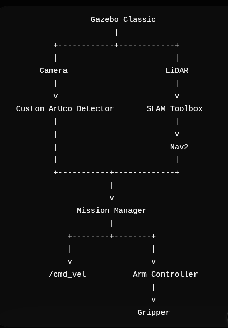

# Autonomous Pick-and-Place Robot

A ROS 2 Humble autonomous pick-and-place robot using TurtleBot3 Waffle Pi, SLAM, Nav2, custom ArUco vision, and OpenMANIPULATOR-X in Gazebo Classic.

---

## Overview

This project implements an autonomous mobile manipulation system in simulation.

The robot can:

- Navigate autonomously using SLAM and Nav2
- Detect ArUco markers using a custom OpenCV detector
- Identify the required target marker (ID 7)
- Center the robot with respect to the target
- Perform a close-range visual approach
- Open the gripper
- Move the OpenMANIPULATOR-X to the pickup position
- Close the gripper
- Lift the object
- Return to the home position using Nav2

The complete system is implemented and tested in Gazebo Classic using ROS 2 Humble.

---

## Key Features

- Autonomous navigation using SLAM and Nav2
- Custom ArUco detection using OpenCV
- Target-specific marker identification (ID 7)
- Camera-based visual target centering
- Straight-line visual final approach
- LiDAR-based collision protection
- OpenMANIPULATOR-X joint trajectory control
- Autonomous gripper open/close control
- Autonomous object pickup and lift
- Nav2-based return-to-home navigation

---

## Project Architecture



The system connects perception, mapping, navigation, mission control, and manipulation.

```text
                         Gazebo Classic
                              |
                +-------------+-------------+
                |                           |
              Camera                      LiDAR
                |                           |
                v                           v
       Custom ArUco Detector          SLAM Toolbox
                |                           |
                |                           v
                |                          Nav2
                |                           |
                +-------------+-------------+
                              |
                              v
                       Mission Manager
                              |
                    +---------+---------+
                    |                   |
                    v                   v
               Mobile Base        OpenMANIPULATOR-X
                                        |
                                      Gripper
```

---

## Main Technologies

- Ubuntu 22.04
- ROS 2 Humble
- Gazebo Classic
- TurtleBot3 Waffle Pi
- OpenMANIPULATOR-X
- SLAM Toolbox
- Nav2
- LiDAR
- OpenCV ArUco
- Python
- ROS 2 Actions

---

# How to Run the Project

The project is operated using multiple terminals. Each terminal runs a different part of the robotic system.

---

## Terminal 1 - Start Gazebo

Source ROS 2 and the workspace:

```bash
source /opt/ros/humble/setup.bash
source ~/turtlebot3_ws/install/setup.bash
```

Start the working Gazebo world:

```bash
ros2 launch turtlebot3_gazebo turtlebot3_world.launch.py
```

### What Terminal 1 does

Gazebo provides the complete simulation environment, including:

- TurtleBot3 Waffle Pi
- OpenMANIPULATOR-X
- Pi Camera
- LiDAR
- Walls and obstacles
- ArUco markers
- Pick object
- Simulated physics

Gazebo also publishes the sensor data used by SLAM, Nav2, and the custom perception nodes.

---

## Terminal 2 - Start SLAM

```bash
source /opt/ros/humble/setup.bash
source ~/turtlebot3_ws/install/setup.bash

ros2 launch slam_toolbox online_async_launch.py use_sim_time:=True
```

### What Terminal 2 does

SLAM Toolbox processes the LiDAR data from:

```text
/scan
```

It creates a map of the environment and maintains the robot's pose estimate.

The map and localization information are used by Nav2 for autonomous navigation.

---

## Terminal 3 - Start Nav2

First source the ROS environment:

```bash
source /opt/ros/humble/setup.bash
source ~/turtlebot3_ws/install/setup.bash
```

Start the working Nav2 launch command used by the simulation.

### What Terminal 3 does

Nav2 is responsible for long-distance autonomous navigation.

It:

- Uses the SLAM map
- Plans collision-free paths
- Uses LiDAR-based costmaps
- Avoids obstacles
- Navigates toward the pickup area
- Returns the robot to the home position

The final approach to ArUco ID 7 is handled by the custom mission controller.

---

## Terminal 4 - Start the Custom ArUco Detector

```bash
source /opt/ros/humble/setup.bash
source ~/turtlebot3_ws/install/setup.bash

ros2 run custom_aruco_detector aruco_detector
```

### What Terminal 4 does

The custom detector subscribes to:

```text
/pi_camera/image_raw
```

and reads camera calibration from:

```text
/pi_camera/camera_info
```

The detector uses OpenCV ArUco detection with:

```text
DICT_5X5_50
```

The environment can contain multiple markers, but the autonomous mission specifically uses:

```text
Target ID = 7
```

The detector identifies the marker and estimates its position relative to the camera.

---

## Terminal 5 - View the Debug Camera Image

Start the image viewer:

```bash
source /opt/ros/humble/setup.bash
source ~/turtlebot3_ws/install/setup.bash

rqt_image_view
```

Select:

```text
/aruco/debug_image
```

The debug image can show:

- ArUco marker outline
- Marker ID
- Pose axes
- Target X position
- Target Z distance

The important measurements are:

```text
X = horizontal position of the target
Z = forward distance to the target
```

---

## Terminal 6 - Start the Autonomous Mission

```bash
source /opt/ros/humble/setup.bash
source ~/turtlebot3_ws/install/setup.bash

ros2 run pick_place_mission mission_manager
```

### What Terminal 6 does

The mission manager coordinates the complete autonomous workflow:

```text
Nav2
  |
ArUco ID 7
  |
Visual centering
  |
Final approach
  |
Gripper open
  |
Arm positioning
  |
Gripper close
  |
Arm lift
  |
Nav2 return home
```

---

# Autonomous Mission

The robot performs the following sequence:

```text
Home
  |
  v
Nav2 navigation
  |
  v
Pickup station
  |
  v
Detect ArUco ID 7
  |
  v
Center target
  |
  v
Straight visual approach
  |
  v
Stop at Z = 0.15 m
  |
  v
Open gripper
  |
  v
Move arm to pick position
  |
  v
Close gripper
  |
  v
Lift object
  |
  v
Nav2 return home
  |
  v
Mission complete
```

---

# How the Robot Works

## 1. Navigate to the Pickup Area

The robot first uses SLAM and Nav2 to navigate from its starting position to the predefined pickup area.

The navigation stage handles the large-scale movement through the environment.

The robot does not use random marker searching while Nav2 is operating.

---

## 2. Detect ArUco Marker ID 7

After reaching the pickup area, the Pi Camera observes the ArUco markers.

The custom detector processes:

```text
/pi_camera/image_raw
```

and detects the markers using OpenCV.

The environment can contain multiple markers, but the mission manager selects:

```text
ID 7
```

as the pickup target.

---

## 3. Estimate Target Position

The detector estimates the target position relative to the camera.

The mission controller uses:

```text
X = horizontal target position
Z = forward target distance
```

The controller uses X to determine whether the target is left or right of the robot's center line.

---

## 4. Center the Target

Before moving forward, the robot first centers ID 7.

The horizontal error is reduced toward:

```text
X -> 0
```

Once the marker is sufficiently centered, the robot stops rotating and proceeds to the forward approach.

This prevents the robot from approaching the marker diagonally.

---

## 5. Straight-Line Final Approach

After the target is centered, the robot moves forward.

During the final approach:

```text
linear velocity > 0
angular velocity = 0
```

The camera continuously estimates the marker distance.

The experimentally calibrated final visual stopping distance is:

```text
Z = 0.15 m
```

At this distance, the mobile base stops and the manipulation sequence begins.

---

## 6. LiDAR Safety Protection

LiDAR provides an independent obstacle-protection layer.

The navigation costmaps use:

```text
/scan
```

The final visual controller also checks the forward LiDAR region.

The robot stops if a persistent unsafe obstacle condition is detected.

This allows the camera to provide precision while LiDAR provides collision protection.

---

## 7. Open the Gripper

Once the final approach is complete, the mobile base remains stationary.

The gripper is controlled using:

```text
/gripper_controller/gripper_cmd
```

The gripper opens before the arm moves into the pickup configuration.

---

## 8. Move the OpenMANIPULATOR-X

The arm is controlled using:

```text
/arm_controller/follow_joint_trajectory
```

The calibrated pickup configuration is:

```text
joint1 = 0.0
joint2 = 0.95
joint3 = -0.95
joint4 = 0.0
```

The arm moves to this configuration using a joint trajectory.

---

## 9. Close the Gripper

After the arm reaches the pickup position:

```text
Gripper OPEN
      |
      v
Arm moves to pickup pose
      |
      v
Gripper CLOSE
```

The robot then prepares to lift the object.

---

## 10. Lift the Object

After closing the gripper, the arm moves to a higher configuration.

This creates clearance between the object and the pickup surface before the mobile base starts moving again.

The mobile base remains stationary during manipulation.

---

## 11. Return to the Home Position

After the object is lifted, the mission manager sends a new Nav2 goal to the predefined home position.

Current home pose:

```text
x   = -0.007 m
y   =  0.001 m
yaw =  0.039 rad
```

Nav2 then handles the return navigation using the map, localization, and obstacle avoidance.

<<<<<<< HEAD
Results
=======
The return journey does not require manual teleoperation.

---

## 12. Mission Completion

The complete workflow is:

```text
Gazebo
  |
  v
SLAM
  |
  v
Nav2
  |
  v
Pickup station
  |
  v
ArUco ID 7
  |
  v
Target centering
  |
  v
Final approach
  |
  v
Z = 0.15 m
  |
  v
Gripper OPEN
  |
  v
Arm PICK
  |
  v
Gripper CLOSE
  |
  v
Arm LIFT
  |
  v
Nav2 HOME
  |
  v
MISSION COMPLETE
```

---

# Custom ROS 2 Packages

## custom_aruco_detector

Location:

```text
src/custom_aruco_detector/
```

Main source file:

```text
src/custom_aruco_detector/custom_aruco_detector/aruco_detector.py
```

Responsibilities:

- Subscribe to camera images
- Detect ArUco markers
- Identify marker IDs
- Estimate marker pose
- Generate debug images
- Provide target position information

---

## pick_place_mission

Location:

```text
src/pick_place_mission/
```

Main source file:

```text
src/pick_place_mission/pick_place_mission/mission_manager.py
```

Responsibilities:

- Coordinate Nav2
- Select target marker ID 7
- Center the target
- Perform final visual approach
- Monitor LiDAR safety
- Control the OpenMANIPULATOR-X
- Control the gripper
- Lift the object
- Return the robot home

---

# Important ROS 2 Topics

## Camera

```text
/pi_camera/image_raw
/pi_camera/camera_info
```

## LiDAR

```text
/scan
```

## Mobile Base

```text
/cmd_vel
```

## ArUco

```text
/aruco/marker_ids
/aruco/debug_image
```

## Navigation

```text
/navigate_to_pose
```

## Arm

```text
/arm_controller/follow_joint_trajectory
```

## Gripper

```text
/gripper_controller/gripper_cmd
```

---

# Configuration

The mission configuration is stored in:

```text
config/pick_config.yaml
```

Current configuration:

```yaml
marker_id: 7

pick_pose:
  x: 0.800
  y: -1.067
  yaw: -1.581

home_pose:
  x: -0.007
  y: 0.001
  yaw: 0.039

arm_pose:
  joint1: 0.0
  joint2: 0.95
  joint3: -0.95
  joint4: 0.0
```

Final visual approach distance:

```text
Z = 0.15 m
```

---

# Important Manual Testing Commands

These commands were used during development to verify individual components.

## Camera

```bash
ros2 topic info /pi_camera/image_raw -v
```

```bash
ros2 topic echo /pi_camera/camera_info --once
```

## LiDAR

```bash
ros2 topic info /scan -v
```

```bash
ros2 topic hz /scan
```

## Controllers

```bash
ros2 control list_controllers
```

Expected controllers include:

```text
joint_state_broadcaster
gripper_controller
imu_broadcaster
arm_controller
```

## Arm Action

```bash
ros2 action list | grep arm
```

Expected:

```text
/arm_controller/follow_joint_trajectory
```

## Test Arm Pickup Pose

```bash
ros2 action send_goal /arm_controller/follow_joint_trajectory control_msgs/action/FollowJointTrajectory "{trajectory: {joint_names: ['joint1','joint2','joint3','joint4'], points: [{positions: [0.0,0.95,-0.95,0.0], time_from_start: {sec: 4}}]}}"
```

## Check End-Effector Position

```bash
ros2 run tf2_ros tf2_echo base_link end_effector_link
```

## Check Robot Pose

```bash
ros2 run tf2_ros tf2_echo map base_link
```

The measured home pose used by the mission is approximately:

```text
x   = -0.007
y   =  0.001
yaw =  0.039
```

---

# Screenshots

## Gazebo Simulation


## ArUco Detection


## SLAM and Nav2


## Autonomous Pick and Return


## Project Architecture


---

# Results
>>>>>>> 23b7fc1 (Update README with complete project documentation)

The implemented system successfully demonstrates:

- Autonomous navigation to the pickup area
- SLAM-based mapping and localization
- Nav2 path planning
- LiDAR-based obstacle protection
- Custom ArUco marker detection
- Target-specific marker identification
- Camera-based target centering
- Straight-line final approach
- Close-range positioning
- OpenMANIPULATOR-X arm positioning
- Gripper open and close operation
- Object pickup and lifting
- Autonomous return to the home position

<<<<<<< HEAD
Current Limitations

- The implementation is currently validated in Gazebo Classic simulation.
- The mission uses a predefined target marker ID (ID 7).
- Pickup and placement depend on the simulated object's collision/contact behavior.
- The system has been tuned for the current Gazebo challenge environment.
=======
---

# Difference from the Official Home Service Challenge

This project is based on the TurtleBot3 Home Service Challenge concept but uses a custom perception and mission-control implementation.

Main differences include:

- Custom ArUco detector
- Target-specific marker ID 7 selection
- Camera-based X/Z target estimation
- Custom visual target-centering logic
- Straight-line visual final approach
- Custom ROS 2 mission manager
- Direct arm trajectory control
- Direct gripper action control
- Nav2-based autonomous return

The project follows the same general mobile-manipulation objective while implementing the perception and mission-control pipeline specifically for this Gazebo environment.

---

# Current Limitations

- The implementation is validated in Gazebo Classic simulation.
- The mission currently uses a predefined target marker ID (ID 7).
- The system is tuned for the current Gazebo challenge environment.
- Pickup and placement depend on the simulated object's collision and contact behavior.
- The current mission focuses on a single target object.

---

# Future Improvements

- Automatic object placement
- Multiple target markers
- Multi-object pick-and-place missions
- Improved grasp and release reliability
- Navigation recovery behaviors
- Improved manipulation planning
- MoveIt-based manipulation planning
- Deployment on a physical TurtleBot3 platform

---

# Project Structure

```text
autonomous-turtlebot3-pick-and-place/
|
├── README.md
├── LICENSE
├── .gitignore
|
├── config/
│   └── pick_config.yaml
|
├── screenshots/
│   ├── architecture.png
│   ├── aruco_detection.png
│   ├── autonomous_pick_place.png
│   ├── gazebo_world.png
│   └── nav2_slam.png
|
└── src/
    |
    ├── custom_aruco_detector/
    │   ├── custom_aruco_detector/
    │   │   ├── __init__.py
    │   │   └── aruco_detector.py
    │   ├── package.xml
    │   ├── resource/
    │   ├── setup.cfg
    │   └── setup.py
    |
    └── pick_place_mission/
        ├── pick_place_mission/
        │   ├── __init__.py
        │   └── mission_manager.py
        ├── package.xml
        ├── resource/
        ├── setup.cfg
        └── setup.py
```

---

# Author

**Vatsal Jha**

GitHub:

https://github.com/Vatsaljha

---

# License

This project is released under the MIT License.
>>>>>>> 23b7fc1 (Update README with complete project documentation)
